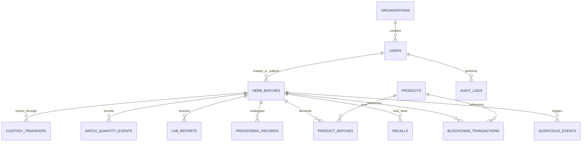

# Entity Relationship Diagram

```mermaid
erDiagram
    ORGANIZATIONS ||--o{ USERS : contains
    USERS ||--o{ HERB_BATCHES : creates_or_collects
    HERB_BATCHES ||--o{ CUSTODY_TRANSFERS : moves_through
    HERB_BATCHES ||--o{ BATCH_QUANTITY_EVENTS : records
    HERB_BATCHES ||--o{ LAB_REPORTS : receives
    HERB_BATCHES ||--o{ PROCESSING_RECORDS : undergoes
    HERB_BATCHES ||--o{ PRODUCT_BATCHES : becomes
    PRODUCTS ||--o{ PRODUCT_BATCHES : uses
    HERB_BATCHES ||--o{ RECALLS : may_have
    HERB_BATCHES ||--o{ BLOCKCHAIN_TRANSACTIONS : references
    PRODUCTS ||--o{ BLOCKCHAIN_TRANSACTIONS : references
    USERS ||--o{ AUDIT_LOGS : performs
    HERB_BATCHES ||--o{ SUSPICIOUS_EVENTS : triggers
```

The entities above are introduced by later migrations. Phase 1 creates only migration history.
